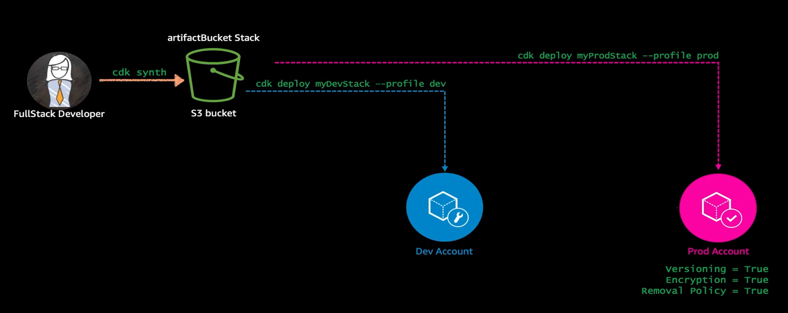

### General


### Project


### Apps
- App is seperate for each environment with different feature
    

### Stacks


### Constructs
- The core framework has many constructs. Each Construct library has packages and modules that represent a AWS Service
- Construct libraries allow you to add complex capabilities to your apps with minimum effort. 
- Constructs can add IAM permissions, expose data to the public or cause your application not to function. 
- It is your responsibility to understand how certain constructs that you use impact your application, and to make sure you only use construct libraries from vendors you trust 
- The construct library has the following
    - Level 3 Constructs - has one or many AWS resources - ex : CI/CD pipeline
    - Level 2 Constructs - Intent based constructs based on AWS services
    - Level 1 Constructs - have one or one mapping to AWS resources to their CloudFormation templates


### Environments


### Bootstraping


### Identifiers


### Tokens

- What is it?
    - CDK tokens = CloudFormation Intrinsic Functions
    - Token represents a single or multiple values in int or string data types.
    - Tokens can only be resolved later in the app life cycle [1]
    - Example - name of the S3 bucket is that you define in the CDK app is only allocated when the AWS CloudFormation template is Synthesized
        

        ```
        bucket = s3.Bucket(self, "MyBucket")

        # Important
        # if you print bucket.bucket_name  you will see the output as below
        # ${TOKEN[Bucket.Name.1234]}


        fn = lambda_.Function(stack, "MyLambda",
        environment=dict(BUCKET_NAME=bucket.bucket_name)) # the bucket.bucket_name is a string.
                                                          # AWS CDK calls this placeholders token        


        ```


### Parameters


### Tagging


### Assets

- CDK has a feature called "Asset" - it will just take the code we wrote, and it will automatically pack it up and send to S3 to create appropriate AWS service

- Assets are local files, directories, or Docker images that can be bundled into AWS CDK libraries and apps. 
    - For example, an asset might be a directory that contains the handler code for an AWS Lambda function. 
    - Assets can represent any artifact that the app needs to operate.


### Permissions


### Context
- CDK.json file contents

        ```
        {
        "app": "mvn -e -q compile exec:java",
        "watch": {
            "include": "src/main/**",
            "exclude": "target/*"
        }
        }


        ```


### Feature Flags


### Aspects


