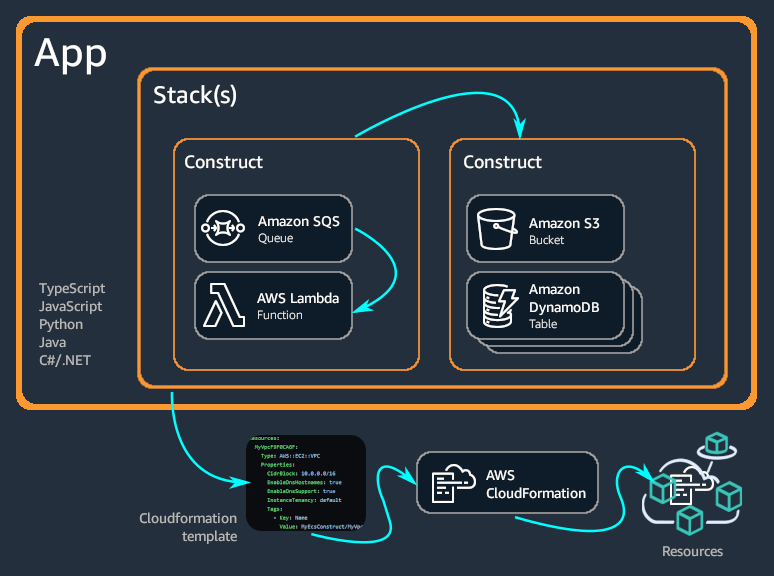
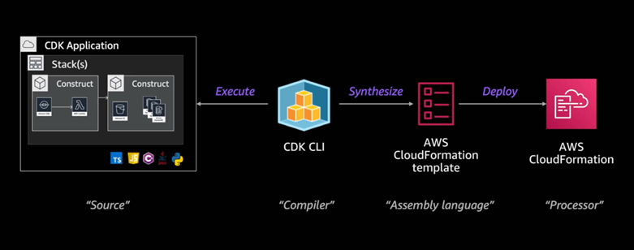
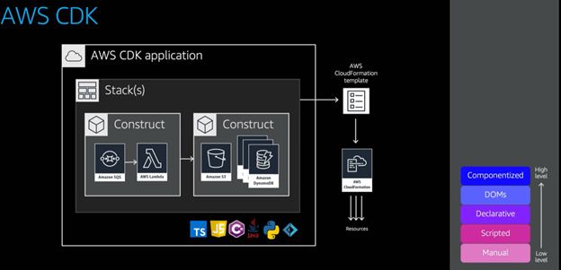

### Introduction
- CDK is not meant to replace CloudFormation. Instead, it provides additional functionality and benefits
- Drawback of CloudFormation Templates are.
    - Extremely long
    - Cannot Unit Test
    - It is like reading a HTML

- Current version is CDK v2
- Open-source SW development framework for defining Cloud infrastructure in code and provisioning it through AWS CloudFormation [1]
- It supports TypeScript, JavaScript, Python, Java, C#, and GO [1]
- Has two main components [1]
    - Core Framework or the Construct Library
        - The programming languages is used to define the reusable cloud components known as the constructs
        - You then compose those constructs together to form stacks and apps. 
        - The apps will then be deployed using the AWS CloudFormation service
    - AWS CDK CLI or the CDK Toolkit
        - A command line tool for interacting with the CDK apps to create, manage and deploy the AWS CDK project

- CDK App and Constructs
    

    (Source: https://docs.aws.amazon.com/cdk/v2/guide/home.html)

### Benefits
- Develop and manage your IaC as code - for infrastructure, application code and configuration in one place
- Define and develop faster using programming languages and with software engineering best practices like code reviews, unit tests and source control
- You can also import existing AWS CloudFormation Templates
- AWS CDK has higher level of resource constructs with AWS best practices
- Repeatable, predictable and can rollback when error
- Deploy Infrastructure through AWS Cloud Formation

    

    (Source: acloudguru training material)

### Ways to deploy Cloudformation template in AWS
- Ways to deploy CloudFormation Template in AWS
    - Manually using AWS Cloud Console
    - Scripted method using APIs
    - Declarative method using CloudFormation
    - DOMs methods using tools like Troposphere (py), Sparkle Foundation (Ruby), and Go Formation (GO)
    - Componentized: Using CDK where the entire stack is componentized

    

### Deleting a stack
- By using cdk destroy
- This command calls the cfn delete stack and that command has some dependencies
- Delete stack can fail due to [2][3]
    - Protected resources
    - When resources are created on top of the resource you delete
        - Ex Security Groups, Routes
    - Circular Dependencies
    - When a stack is created using a IAM role and if that role is deleted
    - Custom resource malformed

